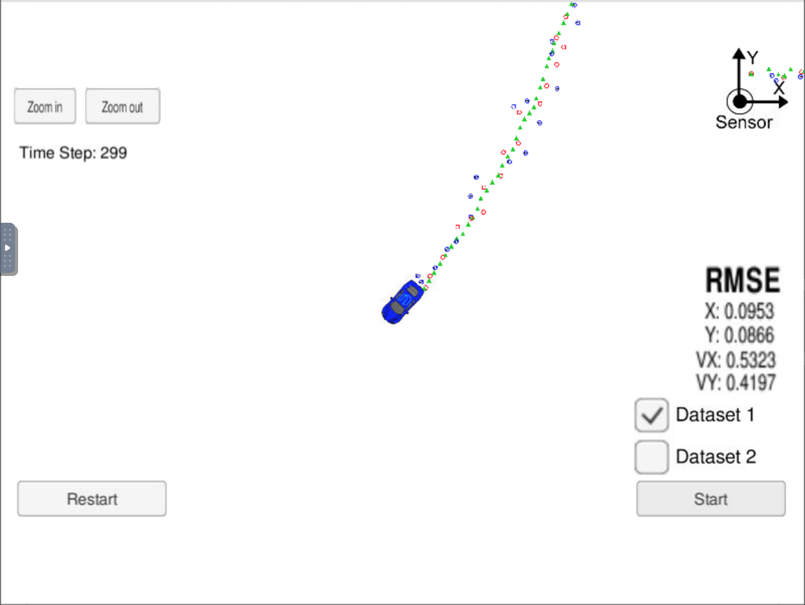

# Extended Kalman Filter Project

In this project an Extended Kalman Filter is used to estimate the state of a moving object of interest with noisy lidar and radar measurements. At each time step, sensor fusion data is fed into the filter. The filter processes the data and outputs an updated state estimation. A Unity simulator (shown in the demo section) was used to visualize and test the extended kalman filter.

This project was completed as part of the Self-Driving Car Engineer Nanodegree Program.

## Demo
A video demo of the Extended Kalman Filter running in simulation can be found [here](./kalman_demo.mov).

How the simulator works:
1. The simulator provides the filter with the measurement data (either lidar or radar) at each time step.  
2. The Filter sends an updated state estimation and RMSE values back to the simulator.
3. The simulator translates the state into a spatial representation and displays the RMSE values.  

Description of the image:
* The image above shows an example of the simulator and the extended kalman filter running.
* The lidar measurements are red circles.
* The radar measurements are blue circles with an arrow pointing in the direction of the observed angle, and estimation markers are green triangles.

## Setup

This project involves the Term 2 Simulator which can be downloaded [here](https://github.com/udacity/self-driving-car-sim/releases).

This repository includes two files that can be used to set up and install [uWebSocketIO](https://github.com/uWebSockets/uWebSockets) for either Linux or Mac systems. For windows you can use either Docker, VMware, or even [Windows 10 Bash on Ubuntu](https://www.howtogeek.com/249966/how-to-install-and-use-the-linux-bash-shell-on-windows-10/) to install uWebSocketIO. Please see the uWebSocketIO Starter Guide page in the classroom within the EKF Project lesson for the required version and installation scripts.

Once the install for uWebSocketIO is complete, the main program can be built and run by doing the following from the project top directory.

1. mkdir build
2. cd build
3. cmake ..
4. make
5. ./ExtendedKF

Here is the main protocol that main.cpp uses for uWebSocketIO in communicating with the simulator.

**INPUT**: values provided by the simulator to the c++ program

["sensor_measurement"] => the measurement that the simulator observed (either lidar or radar)

**OUTPUT**: values provided by the c++ program to the simulator

["estimate_x"] <= kalman filter estimated position x

["estimate_y"] <= kalman filter estimated position y

["rmse_x"]

["rmse_y"]

["rmse_vx"]

["rmse_vy"]

---

## Other Important Dependencies

* cmake >= 3.5
  * All OSes: [click here for installation instructions](https://cmake.org/install/)
* make >= 4.1 (Linux, Mac), 3.81 (Windows)
  * Linux: make is installed by default on most Linux distros
  * Mac: [install Xcode command line tools to get make](https://developer.apple.com/xcode/features/)
  * Windows: [Click here for installation instructions](http://gnuwin32.sourceforge.net/packages/make.htm)
* gcc/g++ >= 5.4
  * Linux: gcc / g++ is installed by default on most Linux distros
  * Mac: same deal as make - [install Xcode command line tools](https://developer.apple.com/xcode/features/)
  * Windows: recommend using [MinGW](http://www.mingw.org/)

## Basic Build Instructions

1. Clone this repo.
2. Make a build directory: `mkdir build && cd build`
3. Compile: `cmake .. && make`
   * On windows, you may need to run: `cmake .. -G "Unix Makefiles" && make`
4. Run it: `./ExtendedKF `

## Generating Additional Data

If you'd like to generate your own radar and lidar data, see the
[utilities repo](https://github.com/udacity/CarND-Mercedes-SF-Utilities) for Matlab scripts that can generate additional data.

Directory Structure
---
    .
    ├── data                            # Waypoint Data
    ├── Docs                            # Documenation of the data flow and data format
    ├── ide_profiles                    # IDE Profiles
    └── src                             # Extended Kalman Filter Code
        ├── Eigen                       # Folder containing files for the Eigen Library
        ├── FusionEFK.cpp               # FusionEKF class cpp file
        ├── FusionEKF.h                 # FusionEKF class header file
        ├── json.hpp                    # json libary for c++
        ├── kalman_filter.cpp           # KalmanFilter class cpp file
        ├── kalman_filter.h             # KalmanFilter class header file
        ├── main.cpp                    # Main
        ├── measurement_package.h       # MeasurementPackage class
        ├── tools.cpp                   # Tools class cpp file
        └── tools.h                     # Tools class header file
